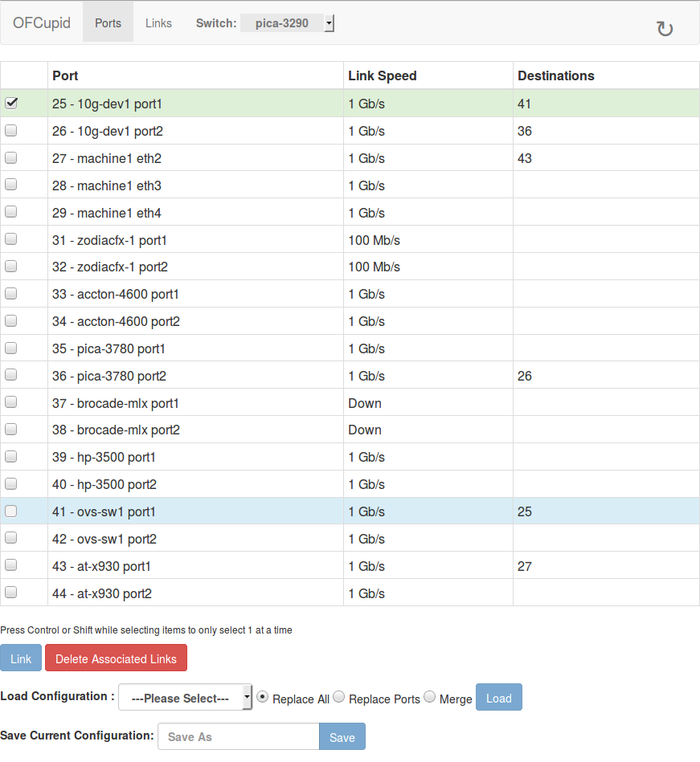
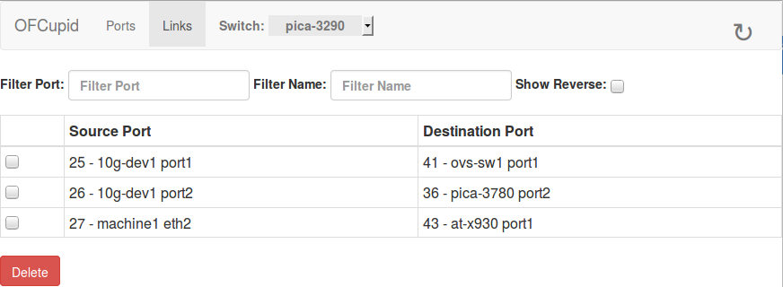

# OFCupid

OFCupid is a Ryu based OpenFlow 1.3 programmable patch panel. Which can be
accessed either through a web-ui or directly via the REST API for scripting.

We intend this to be used in a testbed where a controller and network traffic
can be patched into one of many switches. Increasing the ease of testing new
SDN (or traditional) controllers and configurations on different network
devices.

Features Include:
* Virtually patch two ports together
* Load and save a patch configurations from a file
* Simulated load operation
* Can be restarted or stopped without interrupting forwarding
* Configuration can be reloaded when running
* Web and HTTP REST interface
* Basic independent support for multiple switches
* Standalone, does not require internet access, all required javascript
  libraries are included
* Probably wont work with outdated browsers

## Included Files
`v_patch.py` The ryu application including the webserver.

`v_patch(.html,.js,.css)` Web-ui files.

`third_party/` Contains the bootstrap and angular.js dependencies and their
               licenses (MIT).

`LICENSE` This project is licensed under MIT.

`config.yaml.sample` A sample configuration file.

`configs/` Saved patch panel configurations (must exist to use the save
           feature), typically created via the web-ui, which can then
           easily loaded by a script. The location and name of this directory
           can be reconfigured in config.yaml.

## Configuration

config.yaml includes the configuration in the YAML format, at the very least
the datapath ID of the switch you wish to control must be listed,
otherwise the switch will be ignored. A sample is included as
config.yaml.sample

The datapath ID must be an integer written in decimal or hex.

Anything listed beneath a datapath ID is consider a port name for a port or
list of ports. If not included the port name will be taken from the switch.
In this context the values `"name"` and `"blocked"` have special meaning.
`"name"` is used as the friendly name for the switch, while `"blocked"` can
be used to exclude ports from ofcupid's control.

By default the current running directory and /etc/ryu/ofcupid/ will be searched
for configuration


## Running

Once a configuration file has been created, launch OFCupid like any other
ryu application:
`
ryu-manager --app-lists ./ofcupid.py
`
Ensure you launch from the same directory as the `config.yaml` (or this is
stored in /etc) and the web-ui dependencies if you want to use the web
interface.

You can access the web-ui via http://localhost:8080/. By default ryu will
create a webserver listening on all addresses on port 8080 through which
OFCupid is accessed.

Some useful options to change this behaviour via ryu-manager are:
```
  --wsapi-host: webapp listen host
    (default: '')
  --wsapi-port: webapp listen port
    (default: '8080')
    (an integer)
  --ofp-listen-host: openflow listen host
    (default: '')
  --ofp-tcp-listen-port: openflow tcp listen port
    (default: '6633')
    (an integer)
```

### Docker Container

A docker version is available here https://hub.docker.com/r/wandsdn/ofcupid/
By default the container listens for OpenFlow connections on port 6653 and
hosts the web-ui on port 8080. These can easily be remapped if needed when
exposed outside the container. Configuration is stored in /etc/ryu/ofcupid
a volume should be mounted containing config.yaml.

In config.yaml saved_config_dir should be set to a directory within
/etc/ryu/ofcupid/<config_dir> this way it will persist when updating
the docker.

This can be launched as following:
```
docker pull wandsdn/ofcupid
docker run -d --name ofcupid \
           -v /path/to/ofcupid_config/:/etc/ryu/ofcupid/ \
           -p 80:8080 \
           -p 6653:6653 \
           wandsdn/ofcupid

```

## Screenshots

A screenshot of the ports listing:


A screenshot of the active links:

